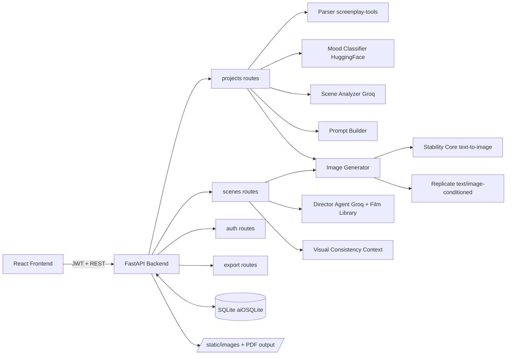

# SceneScope

AI-powered screenplay pre-visualization that helps writers and directors see what their words imply on screen.

SceneScope turns screenplay text into storyboard frames, asks clarifying visual questions, supports iterative refinement, and preserves visual continuity across scenes.

## Why This Exists

Screenplay text is naturally ambiguous. A line like "a dark room" can be interpreted many ways by different collaborators.

SceneScope reduces that ambiguity with a write -> see -> refine loop so teams align earlier in pre-production.

## What It Does

1. Parse screenplay text (Fountain-style scene headings and action) into scenes.
2. Classify each scene mood.
3. Analyze vague visual elements and generate clarifying questions (with suggested defaults).
4. Build a prompt and generate a storyboard image.
5. Refine a scene iteratively with user answers and feedback.
6. Consult an AI Director agent for cinematography guidance.
7. Lock scenes and reuse extracted character/location/prop context for cross-scene consistency.
8. Export storyboard PDF.

## High-Level Architecture



## Backend Pipeline Details

### Scene creation (`POST /api/projects/{project_id}/scenes`)

For each parsed scene:

1. `classify_mood()` -> mood + confidence
2. `analyzeScene()` -> vague elements + clarifying questions + visual summary
3. `buildPrompt()` -> style prefix + mood modifiers + summary (+ optional continuity context)
4. `generateImage()` -> provider fallback order from `IMAGE_PROVIDER_ORDER`
5. Save `scenes` row + first `scene_iterations` row
6. Extract visual details (characters/locations/props) for continuity reuse

### Refinement (`POST /api/scenes/{scene_id}/refine`)

- Max 3 refinements per scene (`MAX_REFINEMENTS`).
- Incorporates answers + freeform feedback + optional Director notes.
- Carries forward previous prompt context for within-scene continuity.
- If previous image is available and public URL configured, refinement uses image-conditioning.
- During reference-based refinement, Replicate is prioritized because Stability core endpoint is text-only.

### Locking and continuity

- Locking a scene stores extracted visual context (`visual_context`) into the scene.
- Future scenes and refinements can include consistency suffixes built from locked scenes to keep recurring people/locations/props stable.

## Core Services

- `sceneAnalyzer.py`: Groq-based scene analysis + clarifying question generation.
- `moodClassifier.py`: HuggingFace mood inference.
- `promptBuilder.py`: central prompt assembly (style + mood + user constraints).
- `imageGenerator.py`: provider orchestration (Stability/Replicate), prompt truncation, image save.
- `visualConsistency.py`: extract and aggregate continuity context.
- `directorAgent.py`: conversational cinematography guidance grounded in `filmLibrary.py`.
- `structureAnalyzer.py`: full-script emotional arc and pacing analysis.
- `shotSuggester.py`: mood-based shot recommendations.

## API Surface (Current)

### Auth

- `GET /api/auth/google`
- `GET /api/auth/google/callback`
- `GET /api/auth/me`

### Projects

- `POST /api/projects`
- `GET /api/projects`
- `GET /api/projects/{project_id}`
- `DELETE /api/projects/{project_id}`
- `DELETE /api/projects/{project_id}/scenes`
- `POST /api/projects/{project_id}/scenes`

### Scenes

- `POST /api/scenes/{scene_id}/refine`
- `POST /api/scenes/{scene_id}/consult`
- `POST /api/scenes/{scene_id}/consult/respond`
- `POST /api/scenes/{scene_id}/lock`
- `POST /api/scenes/{scene_id}/unlock`
- `GET /api/projects/{project_id}/structure`

### Export

- `GET /api/projects/{project_id}/export`

## Tech Stack

| Layer | Technology |
|-------|------------|
| Frontend | React 19, React Router 7, Vite 7, Tailwind CSS v4 |
| Backend | FastAPI, Python 3.11+ |
| Database | SQLite + aiosqlite |
| Analysis LLM | Groq (`llama-3.1-8b-instant`) |
| Mood Model | HuggingFace Inference API |
| Image Generation | Stability Core + Replicate (provider order configurable) |
| Parsing | `screenplay-tools` |
| Export | `fpdf2` |
| Auth | Google OAuth + JWT |

## Repository Structure

```text
backend/
	app/
		routes/      # API endpoints
		services/    # AI and orchestration services
		models/      # Pydantic models
		db.py        # DB init/access helpers
		main.py      # FastAPI app entry
frontend/
	app/
		routes/      # React Router route modules
		components/  # UI components
scripts/
	db.sql         # SQLite schema
docs/
	architecture.md
```

## Setup

### Prerequisites

- Python 3.11+
- Node.js 20+
- API keys: Groq, HuggingFace, and at least one image provider (Stability and/or Replicate)
- Google OAuth credentials for login

### Backend

```bash
cd backend
python -m venv .venv
source .venv/bin/activate
pip install -r requirements.txt

# create and edit environment config
cp .env.example .env

# run API
uvicorn app.main:app --reload --port 8000
```

Important environment values used by current code:

- `GROQ_API_KEY`
- `HUGGINGFACE_API_TOKEN`
- `HF_MODEL_ID`
- `STABILITY_API_KEY`
- `REPLICATE_API_TOKEN`
- `REPLICATE_MODEL_VERSION`
- `IMAGE_PROVIDER_ORDER` (default: `stability,replicate`)
- `GOOGLE_CLIENT_ID`
- `GOOGLE_CLIENT_SECRET`
- `JWT_SECRET_KEY`
- `FRONTEND_URL`
- `BACKEND_PUBLIC_URL` (needed for image-conditioned refinement URLs)

### Frontend

```bash
cd frontend
npm install
npm run dev
```

### Health check

`GET /api/health` returns `{ "status": "ok" }`.

## Notes

- Generated images are stored in `static/images` and served from `/static/images`.
- Scene iterations store prompt history, answers, feedback, and provider output for auditability.
- `docs/architecture.md` exists, but this README is intended to be the most up-to-date overview.

## Contributor

- Suryateja Duvvuri (https://github.com/SuryatejaDuvvuri)
